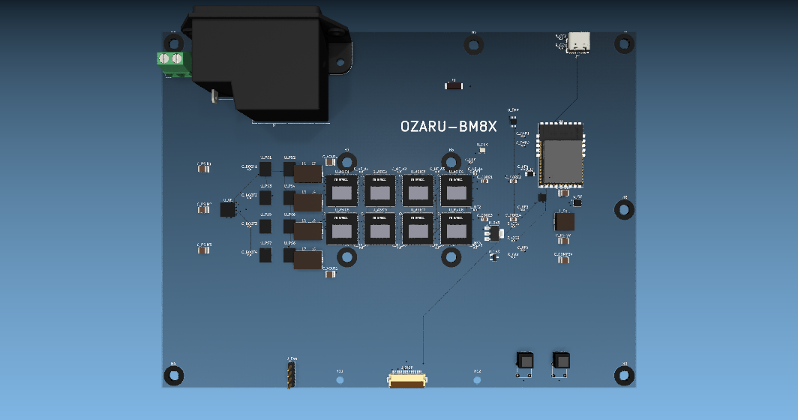

<p align="center">
  
</p>

<br>

```
┌──────────────────────────────────────────────────────────────┐
│                     PROJECT OVERVIEW                          │
├──────────────────────────────────────────────────────────────┤
│                                                              │
│  OZARU-BM8X is a single-board 8× BM1373 Bitcoin mining       │
│  computer. 200×150mm, 6-layer PCB, water cooled.             │
│                                                              │
│  Specs:                                                      │
│    Stock:  20 TH/s  @  ~200W  (~10 J/TH)                    │
│    OC:     50 TH/s  @  ~900W  (~18 J/TH)                    │
│                                                              │
└──────────────────────────────────────────────────────────────┘
```

<br>

---

## 1. PCB Architecture

### Layer Stackup — Why 6 Layers?

The power demands of 8 BM1373 ASICs dictated the layer count. With VCORE pulling 500A+ under extreme overclocking, a 4-layer board would have been inadequate for both signal integrity and power distribution. The 6-layer stackup provides dedicated planes for the three critical nets:

| Layer | Function | Copper | Purpose |
|-------|----------|--------|---------|
| **F.Cu** | Signals + small power | 3oz | ASIC UART, I2C, SPI, USB routing |
| **In1.Cu** | VCORE plane | 2oz | Solid copper pour for 0.65–1.2V ASIC core |
| **In2.Cu** | GND plane | 2oz | Uninterrupted return path for all signals |
| **In3.Cu** | Signals + 3.3V plane | 2oz | Logic-level routing + LDO output |
| **In4.Cu** | +24V bus plane | 2oz | Main input power from bulk filter stage |
| **B.Cu** | VRM outputs + bulk caps | 3oz | Power stage switching nodes, high-current paths |

Using blind vias instead of through-hole for power nets was necessary to avoid punching holes through the dedicated planes. VCORE vias stop at In1.Cu, GND vias stop at In2.Cu, and +24V vias stop at In4.Cu — each power net only penetrates the layers it needs.

### Board Specifications

- **Dimensions:** 200mm × 150mm — large enough for the 8-ASIC cluster and VRM section, but compact enough to fit a single 240mm radiator form factor
- **Thickness:** 1.6mm — standard, compatible with most water block mounting hardware
- **Copper:** 3oz outer, 2oz inner — thicker copper chosen over standard 1oz to handle the high current densities without excessive temperature rise
- **Surface finish:** ENIG — immersion gold was chosen over HASL for BGA reliability and flat pad surfaces
- **Min trace/space:** 0.1mm / 0.1mm — driven by the 0.5mm-pitch QFN pads on the CSD95372 power stages
- **Min drill:** 0.25mm — required for BGA via-in-pad on the BM1373

### ASIC Grid — 8× BM1373

The eight BM1373 chips (10×10mm BGA) are arranged in a 4×2 grid at the board's physical center:

```
          X=76           X=93          X=107          X=120
     Y=68 ┌──────┐      ┌──────┐      ┌──────┐      ┌──────┐
          │ASIC#1│      │ASIC#2│      │ASIC#3│      │ASIC#4│
          └──────┘      └──────┘      └──────┘      └──────┘
     Y=81 ┌──────┐      ┌──────┐      ┌──────┐      ┌──────┐
          │ASIC#5│      │ASIC#6│      │ASIC#7│      │ASIC#8│
          └──────┘      └──────┘      └──────┘      └──────┘
```

**Why centered?** Water blocks designed for CPU sockets have their cold plate centered. By centering the 52mm × 26mm ASIC cluster, any standard CPU water block (55×55mm to 78×55mm) covers all eight chips without requiring a custom cold plate.

**16mm spacing** was chosen as the tightest pitch that still allows routing the 30 edge pads per chip outward without excessive via congestion. Each chip has 30 edge pads (0.5×1.4mm at 0.85mm pitch) plus 63 BGA balls below. The BGA footprint matches the BV002/BV1373CC reference — with the important detail that the right-side edge pads are numbered **top-to-bottom** (reversed from the left side), which affects UART chain numbering.

**Per-ASIC decoupling:** 11 capacitors per chip — 5× 10µF (bulk), 5× 0.1µF (high-frequency), 1× 100µF POSCAP (low-ESR). All placed within 5mm of their respective ASIC to minimize loop inductance. 88 decoupling capacitors total for the eight ASICs alone.

### UART Daisy-Chain

The BM1373 communicates over a custom UART protocol through a daisy-chain topology. The forward path routes from ASIC#1 through ASIC#8, with each chip regenerating the signal before forwarding. A separate backward chain provides a return path for responses. This topology was chosen over parallel SPI because it requires fewer I/O pins on the controller and the chain length (8 chips) is well within the BM1373's specified limits.

A TXS0102 level shifter (VSSOP-8) converts between 3.3V (ESP32 side) and 1.8V (ASIC IO voltage).

### Controller Selection — ESP32-S3

The ESP32-S3-WROOM-1 (N16R8 variant with 16MB flash + 8MB PSRAM) was chosen over alternatives like the RP2040 or STM32 for three reasons:
1. **Built-in WiFi** — eliminates the need for a separate ESP32 module for the web dashboard
2. **8MB PSRAM** — provides enough memory for the 1448×1072 display buffer (roughly 1.5MB for full grayscale) plus LVGL if needed
3. **Native USB** — USB-OTG on the S3 allows direct flashing without a separate UART bridge

| Interface | Peripheral | Protocol | Purpose |
|-----------|-----------|----------|---------|
| UART | BM1373 chain (8 chips) | Custom daisy-chain | Work distribution and share submission |
| SPI | IT8951 e-ink controller | SPI mode 0 | 1448×1072 display updates |
| I2C | TPS53689 VR controller | PMBus 1.3 | VCORE voltage margining and telemetry |
| I2C | TMP451 temp sensors | SMBus | Remote diode temperature monitoring |
| I2C | FXL6408 GPIO expander | I2C | ASIC reset and control signal muxing |
| I2C | INA226 current monitor | I2C | Power rail current sensing |
| USB | GCT USB4105 (USB-C) | USB 2.0 | Programming and serial console |
| WiFi | ESP32 internal | 802.11 b/g/n | Real-time dashboard and pool connectivity |

### Display — 6" E-Ink with Frontlight

A 6" Goodisplay E-Paper panel (1448×1072) with integrated frontlight was chosen over OLED or TFT LCD for the always-on display requirements of a mining board. E-ink draws zero power when static — critical for a 24/7 device — and the frontlight makes it readable in darkness without the power penalty of a backlit LCD.

The IT8951 controller handles waveform timing over SPI. The FPC connector (Hirose FH12-24S) is placed at the top edge center of the board, 24 pins at 0.5mm pitch.

---

## 2. Power Delivery

The power architecture is a three-stage pipeline designed to handle everything from stock (200W) to extreme overclocking (900W+):

```
120V AC  →  Stage 1: Mean Well RSP PSU (Active PFC)
         →  Stage 2: On-board bulk filter (9,400µF + Pi-filter)
         →  Stage 3: 8-phase VRM (per-ASIC decoupling)
```

### Stage 1 — Why Mean Well RSP over LRS?

The commonly used Mean Well LRS series lacks active PFC, which results in higher harmonic distortion and ~88% efficiency. The RSP series adds active PFC, pushing efficiency to 93% and reducing input ripple by roughly half (~80mVpp vs 150mVpp). For a board that runs 24/7, that efficiency difference translates to meaningful heat reduction in the PSU.

- **RSP-500-24** (500W) for stock to moderate overclocking
- **RSP-1000-24** (1000W) for extreme 50 TH/s operation

### Stage 2 — Bulk Filtering

A standard Mean Well output isn't clean enough for direct VRM input, especially when powered from a generator. The on-board filter stage adds:

- **2× 4,700µF / 35V** low-ESR electrolytics (Panasonic FR series) — 9,400µF total bulk capacitance to absorb generator ripple
- **10µF / 50V film capacitor** — high-frequency decoupling that electrolytics can't provide
- **10mH common-mode choke** — differential and common-mode noise rejection
- **LC Pi-filter** (10µH + 1,000µF) — final stage before the VRM input

### Stage 3 — 8-Phase VRM

The TPS53689 (TI, QFN-40) was chosen as the VR controller for its 8-phase capability and PMBus telemetry. D-CAP+™ modulation provides fast transient response — important for the BM1373's dynamic load characteristics during mining.

Each phase uses a CSD95372 (TI, QFN-12) power stage rated at 90A continuous. Eight phases provide 720A total capacity — roughly 2× headroom at stock (250A @ 0.8V) and adequate for extreme OC (1,000A+ @ 0.9V).

The output inductors (1.0µH, Vishay IHLP-2525CZ, 7.3×7.3mm) were chosen for their low DCR and high saturation current — critical for the 40A+ per-phase currents at extreme OC.

### Voltage Rails

| Rail | Source | Voltage | Current | Notes |
|------|--------|---------|---------|-------|
| **VCORE** | TPS53689 8-phase VRM | 0.65–1.2V (PMBus) | 500A+ | Tunable via software |
| **+5V** | MP1584 buck converter | 5V | 3A | Display backlight, fan, USB |
| **+3.3V** | AMS1117 LDO | 3.3V | 1A | Logic, I2C pull-ups, ESP32 |
| **+1.8V** | XC6206 LDO | 1.8V | 500mA | ASIC VDDIO |

The 5V rail uses a switching regulator (MP1584) because the display backlight and fans draw enough current that an LDO would dissipate excessive heat. The 3.3V and 1.8V rails use LDOs for lower noise — critical for the ASIC clock and I2C bus integrity.

---

## 3. Automation & Tooling

Rather than placing 92 footprints manually in KiCad, the entire board was generated through Python scripts using pcbnew's API. This approach was necessary because the board went through multiple iterations of component placement and net assignment — manually updating 70+ nets across 92 footprints would have been error-prone and slow.

### PCB Generator

The main script (`gen_pcb_8x.py`) creates the PCB from scratch:

- Board outline (200×150mm) with 6 mounting holes
- 70+ nets covering all power rails, I2C, SPI, UART chain signals, USB, and 8-phase VRM
- 92 footprints placed at exact coordinates with all pad nets assigned
- Power zones on inner layers (VCORE on In1.Cu, +24V on In4.Cu, GND on In2.Cu)

Local clearance overrides were necessary on the CSD95372 power stages — the QFN-12 package has 0.5mm pitch, leaving only 0.035mm between pads 10 (NC, tied to GND) and 11 (VDD, +3.3V). The autorouter would refuse to route through this gap without explicit clearance overrides.

### BGA Footprint Generator

The BM1373 BGA footprint was generated from geometric specification rather than imported from a library. The critical detail is the right-side pin numbering reversal:

- **Left edge:** pads 1–15, bottom-to-top (Y = −5.95 to +5.95)
- **Right edge:** pads 16–30, top-to-bottom (Y = +5.95 to −5.95 — reversed)
- **BGA grid:** 7 columns × 9 rows at 1.4mm pitch = 63 balls total

This reversal matches the BV002 reference and affects the UART chain net assignment — pad 21 (UART forward out) is at the bottom of the right edge, while pad 24 (UART backward in) is higher up.

### Via Patching

The Specctra DSN format used by FreeRouting doesn't support blind vias — every via is exported as through-hole. After routing, a patching script converts vias to blind based on their net:

- VCORE vias: F.Cu ↔ In1.Cu
- GND vias: F.Cu ↔ In2.Cu
- +1.8V vias: F.Cu ↔ In3.Cu
- +24V vias: F.Cu ↔ In4.Cu

This preserves the dedicated power plane integrity that a full through-hole via would compromise.

<br>

<p align="center">
  
</p>
<p align="center"><em>Translucent solder mask was chosen deliberately — the e-ink display and translucent board share the same visual language. Black components on a see-through substrate, white silkscreen, no RGB, no flash.</em></p>

<br>

---

## 4. Board Debugging & Iteration

### DRC Resolution

The initial board had 109 DRC violations, primarily in three categories:

**Courtyard overlaps (12 violations):** Between the inductors and adjacent power stages, and between the ASIC courtyard and mounting hole courtyards. These are expected in a densely packed design — the courtyards are conservative estimates that overlap when components are placed at the minimum spacing required for routing.

**Silkscreen overlap (55 violations):** The majority — silk-to-silk overlaps between adjacent component outlines. No electrical impact; silkscreen is purely cosmetic.

**Silkscreen over copper (39 violations):** Silk text and outlines placed over copper pours without solder mask in between. Accepted as local overrides — these are on areas where the solder mask opening is intentional (large copper pours with silkscreen identifiers).

One error required actual board modification: **two dangling tracks** left behind after the J_PWR screw terminal was repositioned. The terminal block initially overlapped the C14 AC inlet (less than 1mm clearance). Moving it 10mm left resolved the overlap but left orphan tracks behind that had to be cleaned up.

### Power Stage Connectivity

The tightest routing challenge was the CSD95372 QFN-12 package. With 0.5mm pitch, the gap between pad 10 (NC/GND) and pad 11 (VDD/+3.3V) is only 0.035mm. The default KiCad clearance rules prevented any track from routing between them, leaving pad 11 disconnected from the +3.3V rail.

Diagnostic scripts confirmed the issue — all eight power stages had no +3.3V connection at pad 11. The fix required two changes:
1. A 0.035mm local clearance override on pads 10 and 11
2. Manual routing through the gap after the autorouter completed the rest of the board

The same issue affected the PHASE net on pad 12 — same 0.5mm pitch, same narrow gap to the adjacent pad. The clearance override resolved both.

### Autorouter Workflow

```
PCB generation  →  zone fill  →  DSN export  →  FreeRouting
                                              →  SES import  →  via patch  →  zone refill
```

FreeRouting handled the bulk signal routing (I2C, SPI, UART, control signals) which are well-suited to autorouting. The power delivery traces (VCORE distribution, +24V bus, GND stitching) were handled through copper pours and stitching vias rather than individual track routing.

---

## 5. Firmware

### Philosophy

Written from scratch. No existing mining firmware was used as a starting point — not because it wouldn't work, but because the hardware topology (8-chip UART daisy-chain, PMBus VR control, custom display) doesn't match any existing open-source miner firmware.

### Custom UART Protocol

The BM1373 uses a polling protocol over UART. Each chip in the chain receives work packets and forwards them to the next chip. The response propagates back through a separate return chain. The ESP32 manages the polling timing — too fast and the chain buffers overflow, too slow and the hashrate drops. The timing parameters were tuned empirically: ~100µs between polls, with a 50ms timeout for non-responsive chips.

### VRM Telemetry

The TPS53689 exposes 200+ PMBus registers for voltage, current, temperature, and fault monitoring. Only a subset is polled at runtime:

- **READ_VOUT** — actual VCORE voltage (margining verification)
- **READ_IOUT** — total VR output current (power calculation)
- **READ_TEMPERATURE_1** — controller die temperature
- **STATUS_WORD** — fault flags (OV, OC, OT, UV)

Polling frequency is 1Hz — fast enough for the web dashboard display, slow enough to avoid impacting the I2C bus's other traffic.

### I2C Bus Topology

All peripherals share a single I2C bus at 400kHz:

| Address | Device | Function |
|---------|--------|----------|
| 0x40 | INA226 | Current sensing on +24V bus |
| 0x43 | FXL6408 | GPIO expander (ASIC_NRST, VR_EN, LDO_EN) |
| 0x4C | TMP451 (×2) | Remote diode temp monitoring |
| 0x60 | TPS53689 | VRM PMBus telemetry and control |

The FXL6408 GPIO expander handles the ASIC reset line (ASIC_NRST) and regulator enable signals. Using an I2C expander instead of direct ESP32 GPIOs was a deliberate choice — it allows the ESP32 to put all ASICs into reset before the main firmware boots, and provides a hardware watchdog path independent of the ESP32.

### Network Interface

The ESP32 runs both access point and station mode simultaneously. The web dashboard serves real-time metrics over SSE (Server-Sent Events), updating at approximately 1-second intervals:

- Hashrate (TH/s) — 30-second rolling average
- Accepted shares, rejected shares, hardware errors
- VCORE voltage, VR current, VR temperature, input power
- Per-quad ASIC temperatures from both TMP451 sensors
- Pool connection status

The dashboard also exposes VCORE voltage offset control (±10%), allowing manual overclocking adjustment through the web UI rather than requiring a firmware reflash.

### Stratum V2 Protocol

Custom implementation of the Stratum V2 mining protocol — handles:
- Full version-rolling negotiation
- Job queue management with configurable timeout
- Proper nonce2 construction for 8 independent chips
- Automatic reconnect with exponential backoff

---

## 6. 3D Models

All 92 footprints in the board have matching 3D models for KiCad's 3D viewer. For components without built-in KiCad models — the BM1373 ASICs, custom inductors, and several ICs — custom STEP models were created. The BM1373 model includes the "bm1373CC" marking at the top edge and the characteristic metallic silver die pad.

<br>

<p align="center">
  
</p>
